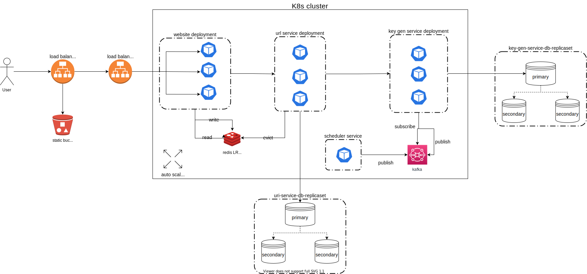
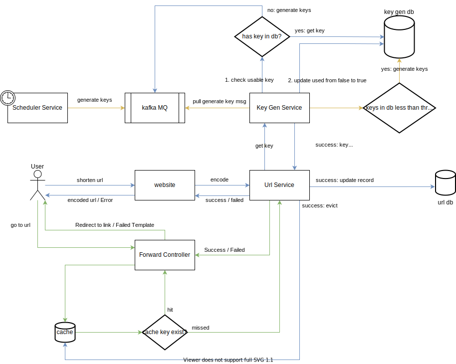

    

<h1 align="center">Short Url</h1>

Implementation of a small shorten url application

## Table of Contents

- [Introduction](#introduction)
- [Features](#features)
- [Design](#design)
- [Limitation](#limitation)
- [Author](#author)

## Introduction

<a href="https://github.com/neowu/core-ng-project">core-ng</a> is an open-source framework for Java Web Application. It designed for micro-service and has integrated with software like ElasticSearch (ES), Redis and Kafka. core-ng has its own log collector and processor to assist with developers for
debugging. It collects logs from the whole system, index them and visualize them in Kibana, developers can easily trace what happened with the unique log ID.

Something to notice:

- key in the project means the encoded part of the url (i.e. https://localhost/ <b style='color: green'>UmlB0B</b> <- this part)
- ES, kibana and log system is not utilized in this project

This project aims to give me a chance to understand how to build docker images and set up a k8s cluster.

## Features:

- Generate shorten url
- Resolve shorten url and redirect user to the destination
- IP Request Limiting (1 call / s)

## Design

### Architecture ###

### Data Flow ###

## Limitation

1. Since keys are generated by batches, if key consumes too fast, Url Service will get empty key frequently.
2. Since the framework does not implement findOneAndUpdate yet, Key Generation Services do not use atomic way to get and update key from db, which means when they select the same key and update it, only the first request will be success.
3. When a batch of keys used up, no shorten url can be generated until Key Generation Service generates the next batch.

## How To Use

Note: For simplicity, the architecture of this demo is not the same with the above graph (no load balancer, auto-scaler and less replica).

1. Turn on Docker and create a kubernetes (K8s) cluster * (it is possible to use other orchestration engine, but you might need to prepare resource files by yourself).
2. Start cluster (command: minikube start)
3. Mount data and datalog directory for zookeeper (command: minikube mount PATH_TO/data:/data, minikube mount PATH_TO/datalog:/datalog)
4. Make sure you are using minikube cluster and apply yaml files in kube directory to create kubernetes resources (command: kubectl apply --recursive -f PATH_TO/kube)
5. Port forward website to localhost (command: kubectl port-forward deploy/website 8443:8443)
6. Open browser and go to https://localhost:8443 (your browser may warn you that the connection is not secure as there is no certificate, just ignore it)
7. Enter your long url into the textbox
8. Copy and paste shorten url in search box. Congrats!

* You can use software like <u>minikube</u> / <u>MicroK8s</u> to create a K8s cluster for testing purpose, I recommend minikube since it is easier to setup

## Author
- [@harrison](https://github.com/harrison-yck)
